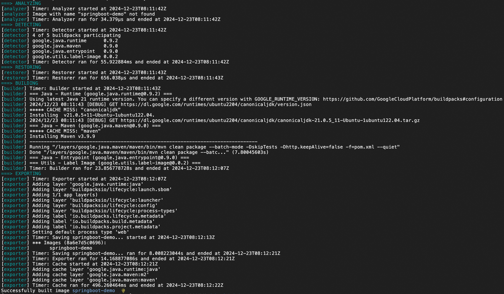
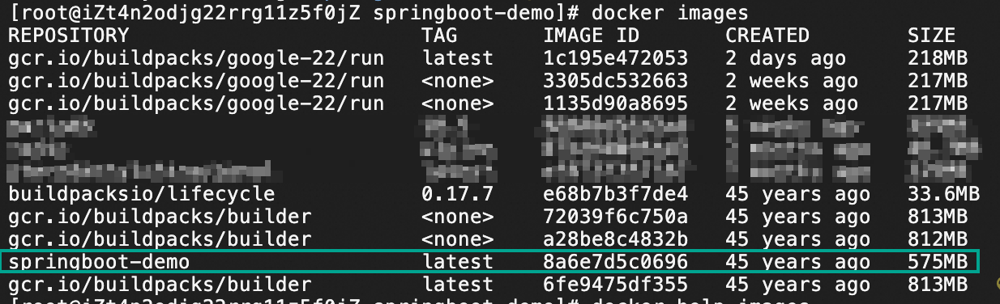
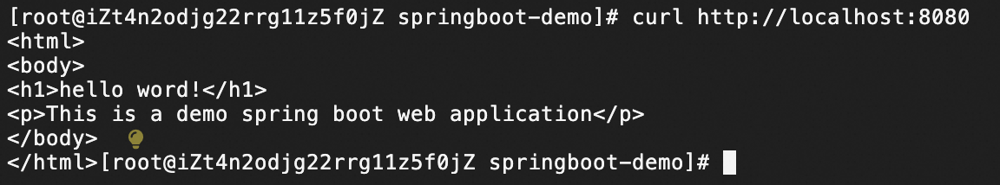
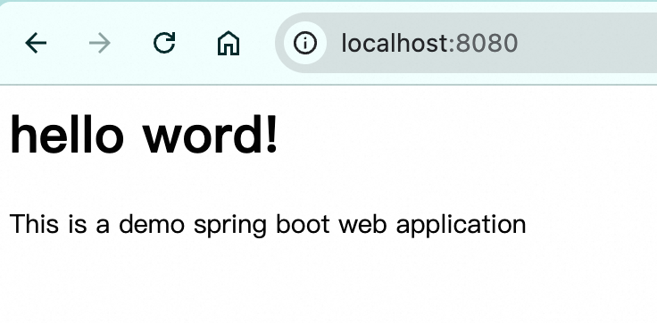

# Java SpringBoot示例应用
此应用是一个快速入门示例，用于展示如何使用Buildpacks构建容器应用

# 手工构建和执行应用

## 使用maven构建
前提条件：下载并安装Java JDK 8、maven

构建应用：`maven clean install`

运行应用：在应用代码所在目录，执行`java -jar target/demo-0.0.1-SNAPSHOT.jar`


## 使用Buildpacks构建容器镜像
此应用支持使用<a href="https://buildpacks.io/" target="_blank">Buildpacks</a>构建容器镜像
前提条件：安装docker、git，注意构建过程中需要下载dockerhub上的镜像
构建方法如下：

```bash
#！/bin/bash
# 下载代码
git clone https://gitee.com/aliyun-computenest/springboot-demo.git
cd springboot-demo
# 下载pack工具；Mac可以使用brew安装pack（brew install buildpacks/tap/pack）
curl -L https://github.com/buildpacks/pack/releases/download/v0.35.1/pack-v0.35.1-linux.tgz -o pack.tgz && tar xvf pack.tgz
# 配置默认builder
# 什么是builder：https://buildpacks.io/docs/for-platform-operators/concepts/builder/
./pack config default-builder gcr.io/buildpacks/builder
# 从应用代码构建容器镜像
./pack build springboot-demo
```            
构建过程日志如下：

构建完成后，可以查看本地的容器镜像，其中springboot-demo:latest是应用容器镜像。


运行容器镜像:
```bash
docker run -d -p 8080:8080 springboot-demo:latest
```

## 访问应用
1. 如果服务器没有提供公网访问，可以通过curl访问localhost WEB服务`curl http://localhost:8080`

2. 也可以在本地浏览器中访问http://localhost:8080

